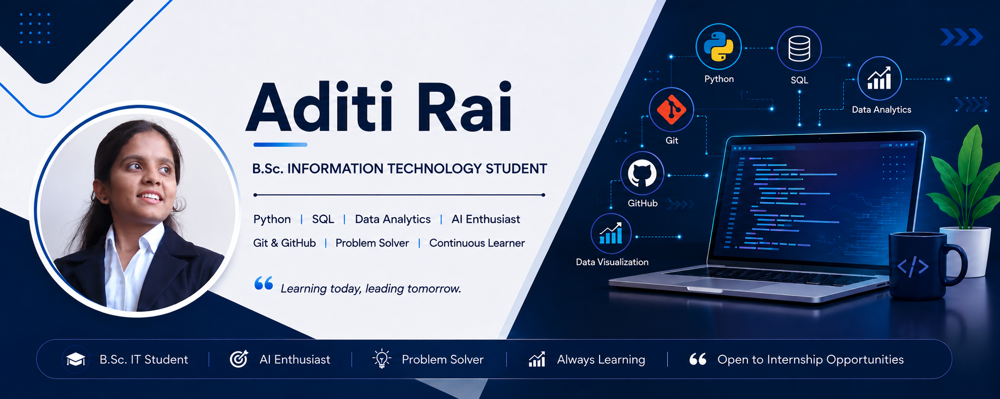

  

# Hi, I'm Aditi Rai 👋

🎓 B.Sc. IT Student

## 👩‍💻 About Me
I am a B.Sc. IT student passionate about Artificial Intelligence, Data Analytics and Software Development. I enjoy learning new technologies and building practical projects.

## 💻 Skills
- Python
- SQL
- Power BI
- Tableau
- Git & GitHub
- PostgreSQL

## 📚 Currently Learning
- AI Tools
- Data Analytics
- Advanced Excel
- Tableau

## 🚀 Projects
- Library Management System
- Python Practice
- SQL Practice
- Forage Virtual Internship Projects

## 🎯 Career Goal
To become a skilled AI & Data Analytics Professional by building real-world projects and continuously improving my technical skills.

---
⭐ Thank you for visiting my profile!
